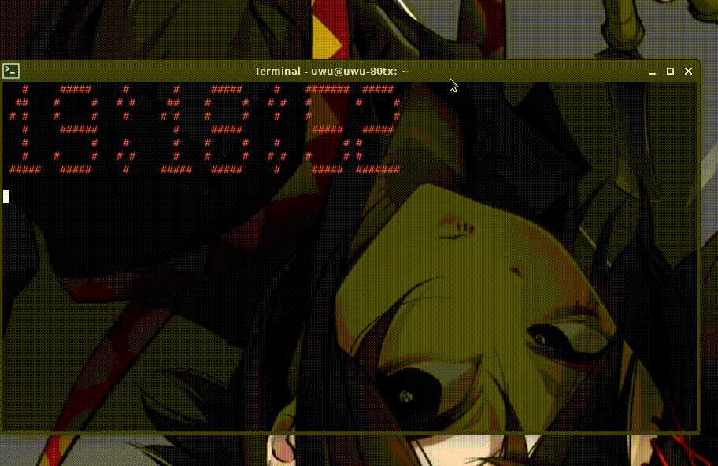

# rice-clock
A rice-like clock for terminals. <br > 


# Installation
1. **Clone the repository** <br >
 - `git clone https://github.com/meth1337/rice-clock && cd rice-clock` or manual cloning
2. **Without use of source code (using binary from github)** <br >
 - Run `bash install.sh`.
3. **With use of source code (building your own)** <br >
 - Navigate to `/src/`
 - Run `bash install-depencies.sh`
 - Run `bash build-binaries.sh`, and then `bash create-command.sh`.

# Usage
The script can be used with entering `rice-clock -(color)`, for example `rice-clock -r` for red color.

# Combining with other terminal color libs
For example, `rice-clock` works pretty good with [lolcat](https://github.com/busyloop/lolcat) (`rice-clock -w | lolcat`): <br >


# Fonts preview
[RAW](https://raw.githubusercontent.com/sepandhaghighi/art/master/FontList.ipynb)

# Changelog
```
v1.0.0:
- First release

v1.0.1:
- Minor fixes

v1.1.0:
- Added:
	- Changelog tab to README
	- 2 more except blocks to the script
	- 1 more installation scrpt (install-depencies.sh)
	- 1 more credit to Credits tab
- Edited:
	- Instruction
	- Main script
	- Installation scripts
v1.1.1:
- Added:
	- New screenshot to README (gif now)
	- Minor fixes to different parts of project
	- New binary
- Edited:
	- README
	- Except blocks (now they work better)
	- 1 installation script (build-binaries.sh)
	- Code documentation
v1.2.0
- Added:
	- Font system (kinda big upd)
- Edited:
	- Switched to new library for ASCII text (https://pypi.org/project/art/)
	- Installation scripts (no need to install banner package anymore)
v1.2.1
- Added:
    - Install script for installation without source code
- Edited:
    - README
    - Main script (help argument)
	- Refactored whole project (it's more user-friendly now.)
v1.2.2
- Added:
    - 12h AM/PM format to script (as an option to switch in the code)
    - 1 more binary for AM/PM (if you want to install 12h format just rename rice-clock-12h to rice-clock)
- Edited
    - README
    - Main script
v1.2.3 (maybe the last release unless something needs to be fixed)
- Added:
    - Bug report and feature request templates
    - License (the project is now licensed under GNU GPL V3)
- Edited:
    - Installation scripts so they now work perfectly
	- README
	- Fixed different parts of projects.
v1.2.4
- Edited:
    - README
    - Fixed "failed to execute script" error
```

# To do:
- Switching the color of text in real time (while the script is running)

# Credits:
 - [Colorama](https://pypi.org/project/colorama/)
 - [Pyinstaller](https://pypi.org/project/pyinstaller/)
 - [Art](https://pypi.org/project/art/)

# Thx for attention!:3

