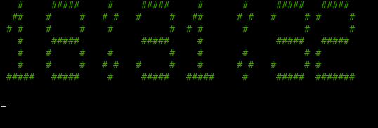

# rice-clock
A rice-like clock for terminals. 

# Usage
The script can be used with entering `python rice-clock.py -(color)` or `rice-clock -(color)` (if you built the command).

# Creating a command
There are two ways to build a command for your linux system, using the binary from this repository or building you own.  
1. **Using binary from GitHub**  
Run `create-command.sh`.  
2. **Creating your own**  
Delete the pre-built binary in the folder of project and run `build-binaries.sh`, and then `create-command.sh`.

# To do:
- Switching the color of text in real time (while the script is running)

# Credits:
[Colorama](https://pypi.org/project/colorama/)
